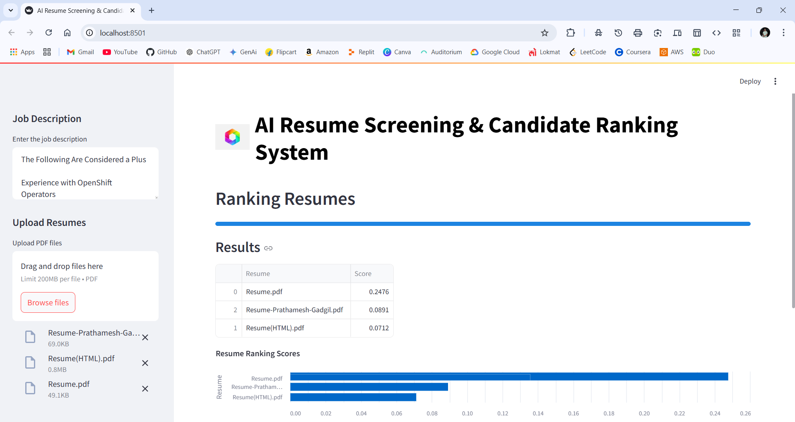

# AI Resume Screening & Candidate Ranking System

## Overview

The AI Resume Screening & Candidate Ranking System is a Streamlit-based web application designed to help recruiters and hiring managers efficiently screen and rank resumes based on a given job description. The application uses Natural Language Processing (NLP) techniques to analyze the content of resumes and compare them to the job description, providing a ranking score for each resume.

## Features

- **Upload Resumes**: Upload multiple PDF resumes for screening.
- **Job Description Input**: Enter the job description to compare against the resumes.
- **Resume Ranking**: Automatically rank resumes based on their relevance to the job description using cosine similarity.
- **Results Visualization**: Display the ranking results in a table and a bar chart.
- **Download Results**: Download the ranking results as a CSV file.

## Screenshot



## Installation

1. Clone the repository:
    ```sh
    git clone https://github.com/PGZON/CVRank.git
    cd Resume_Ranking
    ```

2. Create a virtual environment and activate it:
    ```sh
    python -m venv venv
    source venv/bin/activate  # On Windows, use `venv\Scripts\activate`
    ```

3. Install the required dependencies:
    ```sh
    pip install -r requirements.txt
    ```

## Usage

1. Run the Streamlit app:
    ```sh
    streamlit run Resume.py
    ```

2. Open your web browser and go to `http://localhost:8501`.

3. Enter the job description in the sidebar.

4. Upload the PDF resumes you want to screen.

5. View the ranked resumes and download the results as a CSV file.

## How It Works

1. **Text Extraction**: The application extracts text from the uploaded PDF resumes using the `PyPDF2` library.
2. **TF-IDF Vectorization**: The extracted text and job description are converted into numerical vectors using the `TfidfVectorizer` from `scikit-learn`.
3. **Cosine Similarity**: The cosine similarity between the job description vector and each resume vector is calculated to determine the relevance score.
4. **Ranking**: The resumes are ranked based on their cosine similarity scores.

## Dependencies

- `streamlit`
- `PyPDF2`
- `pandas`
- `scikit-learn`
- `altair`


## License

This project is licensed under the MIT License. See the [LICENSE](LICENSE) file for details.

## Acknowledgements

- Streamlit for providing an easy-to-use framework for building web applications.
- scikit-learn for the powerful machine learning tools.
- PyPDF2 for PDF text extraction.
